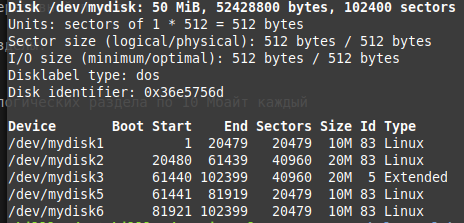
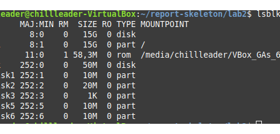

# Лабораторная работа 2

**Название:** "Разработка драйверов блочных устройств"

**Цель работы:** получить знания и навыки разработки драйверов блочных устройств для операционной системы Linux. 

**Вариант:** 2

## Описание функциональности драйвера

Драйвер создает виртуальный жесткий диск размером 50 Мбайт в оперативной памяти.

В соответствии с вариантом задания, диск разбит на следующие разделы:
1. Первичный раздел размером 10 Мбайт
1. Первичный раздел размером 20 Мбайт
1. Расширенный раздел размером 20 Мбайт, также разбитый на два логических раздела по 10 Мбайт каждый

## Инструкция по сборке

```shell
make # Сборка
make do # Загрузить модуль ядра
```

## Инструкция пользователя

Загрузка модуля производится следующей командой:
```shell
insmode main.ko
```
В качестве альтернативы можно воспользоваться make do (см. выше).

Для выгрузки модуля используется следующая команда:
```shell
rmmode main.ko
```
Для выполнения команд загрузки и выгрузки модулей ядра необходимо обладать root-правами.

## Примеры использования

После загрузки модуля можно проверить созданный виртуальный диск с помощью одной из команд ниже:
```shell
fdisk -l /dev/mydisk # Вывод информации о диске и разделах
lsblk # Вывод списка подключенных блочных устройств
```



Отформатировать разделы диска можно с помощью команды mkfs.vfat:
```shell
mkfs.vfat /dev/mydisk1
mkfs.vfat /dev/mydisk2
```

